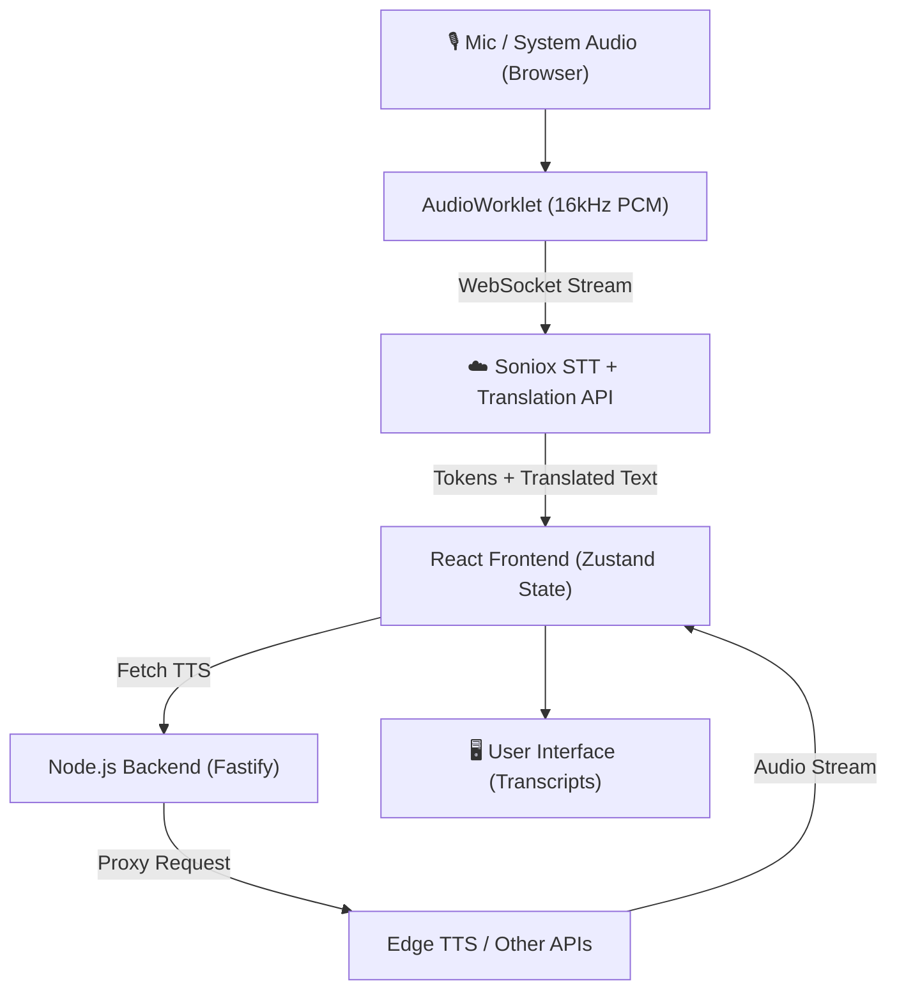

<div align="center">
  

  <h1>AI Cabin Translator (Web Edition)</h1>
  
  <p><strong>A Real-time Speech-to-Text and Translation Web Application</strong></p>
  
  <p>
    
    
    
    
  </p>
</div>

## 📖 Overview

**AI Cabin Translator (Web Edition)** is the modern web-based successor to the original Tauri desktop application. It provides seamless, real-time speech recognition and translation directly in the browser, featuring advanced dual-panel transcript displays, system and microphone audio capture, and multi-provider Text-to-Speech (TTS) integration.

Designed with a privacy-first approach, the core STT processing connects directly to cloud providers from the client-side, while a lightweight Node.js backend proxy handles API protections and WebSocket limitations for TTS features.

## ✨ Features

- 🎙️ **Real-time Translation:** Connects to Soniox STT via WebSocket for continuous, low-latency translation.
- 🎧 **Multi-Source Audio Capture:** Capture audio from the microphone via `getUserMedia` or system audio via `getDisplayMedia` (browser capabilities).
- ⚙️ **Audio Downsampling Worklet:** Native browser `AudioWorklet` automatically converts 48kHz stereo to 16kHz PCM for optimized API payload efficiency.
- 🗣️ **Premium TTS Integration:** High-quality voice output using Microsoft Edge TTS (via backend proxy), Google Cloud, and ElevenLabs.
- 🚀 **Zero-Downtime Sessions:** "Make-before-break" reconnect strategies ensure continuous translation without drops during long sessions.
- 💻 **Monorepo Architecture:** Cleanly separated `frontend` (React + Vite) and `backend` (Fastify + TypeScript) workspaces.

## 🏗️ Architecture



## 🛠️ Technology Stack

**Frontend (Client)**
- React 19 + TypeScript
- Vite (Build Tool & HMR)
- Zustand (State Management)
- Web Audio API & AudioWorklet

**Backend (Server)**
- Node.js 22 + TypeScript
- Fastify (High-performance API framework)
- `ws` (WebSocket proxying)

## 🚀 Getting Started

### Prerequisites
- Node.js (v20 or higher recommended)
- npm or yarn

### 1. Installation

Clone the repository and install all dependencies from the monorepo root:

```bash
git clone https://github.com/lethienvu/AI_CabinTranslator.git
cd AI_CabinTranslator
npm run install:all
```

### 2. Environment Variables

Create a `.env` file in the `backend` directory (if required for API keys, though Edge TTS proxy is currently keyless). For custom STT or TTS providers, refer to the documentation to set up your tokens.

### 3. Running the Development Server

The monorepo is managed via `concurrently`. You can start both the frontend and backend servers simultaneously from the root directory:

```bash
npm run dev
```

- **Frontend:** http://localhost:5173
- **Backend:** http://localhost:3000

## 📁 Project Structure

```text
AI_CabinTranslator/
├── frontend/             # React 19 frontend workspace
│   ├── src/
│   │   ├── worklets/     # Custom AudioWorklet processors
│   │   ├── App.tsx       # Main React component
│   │   └── main.tsx      # Entry point
│   └── vite.config.ts    # Vite config (proxies API to backend)
├── backend/              # Node.js Fastify backend workspace
│   ├── src/
│   │   └── index.ts      # Fastify server & Edge TTS WebSocket proxy
│   └── package.json
├── _reference-desktop_/  # Legacy Tauri desktop app source (git-ignored)
├── package.json          # Root monorepo configuration
└── README.md             # Project documentation
```

## 📜 License

This project is proprietary. All rights reserved.
