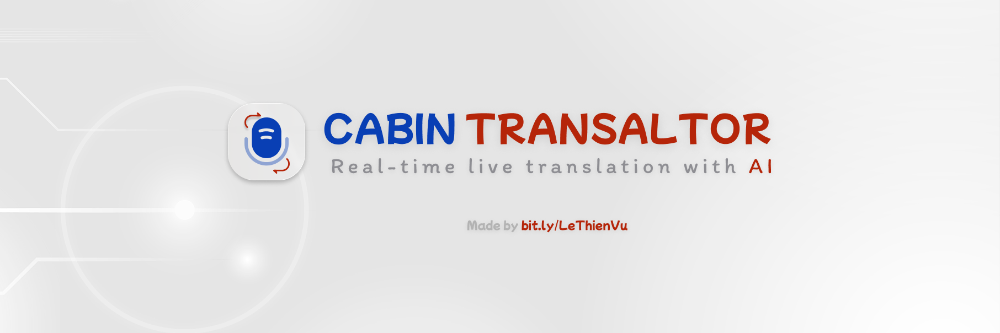

  
  <h1>Cabin Translator (Tauri Desktop)</h1>
  
Ứng dụng dịch nói thành văn bản và dịch thời gian thực trên desktop.

Mục tiêu
- Ghi âm từ hệ thống và micro, chuyển thành văn bản, dịch theo thời gian thực.
- Hiển thị song song văn bản gốc và bản dịch trong giao diện trong suốt.
- Hỗ trợ TTS để đọc bản dịch bằng nhiều nhà cung cấp.

Tổng quan hệ thống
Ứng dụng được xây dựng trên Tauri 2.0. Frontend là giao diện HTML/CSS/JavaScript chạy trong WebView. Backend là Rust, quản lý thu âm hệ thống, thu âm micro, lưu settings, lưu transcript, và proxy Edge TTS.

Kiến trúc tổng thể
1) Frontend (src/index.html, src/js)
- App controller: src/js/app.js
- UI và hiển thị transcript: src/js/ui.js
- Soniox client WebSocket: src/js/soniox.js
- TTS providers: src/js/edge-tts.js, src/js/elevenlabs-tts.js, src/js/google-tts.js
- Audio playback queue: src/js/audio-player.js
- Quản lý settings: src/js/settings.js

2) Backend Tauri (src-tauri)
- Invoke commands: audio, settings, transcript, local_pipeline, edge_tts
- Thu âm hệ thống: ScreenCaptureKit (macOS) hoặc WASAPI (Windows)
- Thu âm micro: cpal
- Lưu settings: JSON trong config dir
- Lưu transcript: file markdown theo timestamp trong app data dir
- Proxy Edge TTS: Rust WebSocket xử lý token và trả về base64 MP3

Luồng dữ liệu chính
Audio capture
- Nguồn âm thanh: system, microphone, hoặc cả hai.
- Rust thu âm và chuyển về PCM s16le 16kHz mono.
- Dữ liệu được gửi sang frontend qua Tauri IPC channel.

STT và dịch
- Frontend mở kết nối WebSocket tới Soniox.
- Gửi audio liên tục, nhận token, văn bản gốc và bản dịch.
- Hỗ trợ gợi ý ngôn ngữ, chế độ one-way và two-way, và context cho Soniox.
- Có cơ chế reconnect và reset session để duy trì kết nối dài.

Local pipeline (tùy chọn)
- Rust chạy Python sidecar (scripts/local_pipeline.py) khi chọn chế độ local.
- Audio được gửi sang pipeline và nhận kết quả qua IPC channel.
- Có script setup MLX (scripts/setup_mlx.py) để cài môi trường.

TTS
- Edge TTS: frontend gọi command edge_tts_speak trong Rust; Rust proxy WebSocket, trả về base64 MP3.
- ElevenLabs và Google TTS: frontend gọi API và phát lại bằng AudioPlayer.
- AudioPlayer quản lý hàng đợi, giảm độ trễ và gộp nhiều đoạn âm thanh.

Lưu trữ và cấu hình
- Settings được đọc và ghi bằng tauri command get_settings/save_settings.
- File settings.json nằm trong config dir (com.personal.translator).
- Transcript được lưu thành file .md theo thời gian trong app data dir.

Các thành phần quan trọng trong Rust
- src-tauri/src/lib.rs: khởi tạo Tauri, register commands và state.
- src-tauri/src/commands/audio.rs: bật tắt thu âm, gom nhiều nguồn.
- src-tauri/src/audio/system_audio.rs và microphone.rs: xử lý thu âm và resample.
- src-tauri/src/commands/edge_tts.rs: proxy Edge TTS.
- src-tauri/src/commands/local_pipeline.rs: quản lý Python sidecar.
- src-tauri/src/commands/transcript.rs: lưu và mở thư mục transcript.

Cấu trúc thư mục
AI_CabinTranslator/
- src/
  - index.html
  - styles/main.css
  - js/
- src-tauri/
  - src/
  - tauri.conf.json
  - Cargo.toml
- scripts/
  - local_pipeline.py
  - setup_mlx.py
- docs/
- cabinTranslator_banner.png

Bản quyền
Dự án này là sở hữu độc quyền. All rights reserved.
